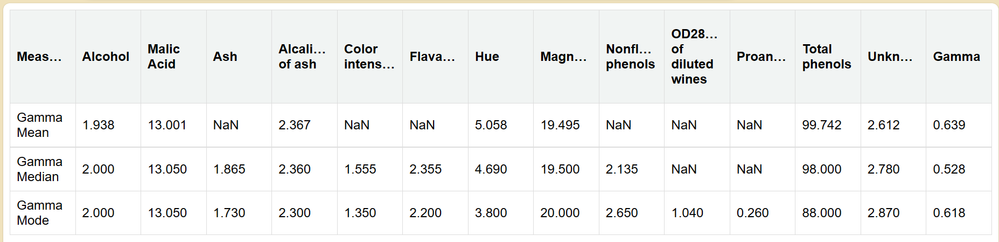

# Project Name - Gamma

## How to Build, Run, and Start the Project

Follow these steps to build, run, and start the project on your local machine:

1. **Clone the Repository:**

   Open your terminal and run the following command to clone the repository to your local machine:

   ```bash
   git clone https://github.com/Abhi-cre/SDE_Interview_GammaTask

2. **Navigate to the Project Directory:**

    cd SDE_Interview_GammaTask

3. **Install Dependencies:**
   
   yarn install

4. **Build the Project:**

   yarn build

5. **Start the Project:**
  
   yarn start

